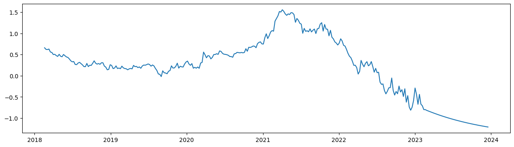

```python
import numpy as np
import pandas as pd
import seaborn as sns
import matplotlib.pyplot as plt
import datetime
import statsmodels.api as sm
```

### 1. Importing Data


```python
df=pd.read_csv('C:\\Users\\Dmitry\\Desktop\\T10Y2Y.csv')
df["T10Y2Y"] = df["T10Y2Y"].replace(".","0.5")
df["T10Y2Y"] = df["T10Y2Y"].astype("float64")
df["DATE"] = pd.to_datetime(df["DATE"])
df.info()
```

    <class 'pandas.core.frame.DataFrame'>
    RangeIndex: 1305 entries, 0 to 1304
    Data columns (total 2 columns):
     #   Column  Non-Null Count  Dtype         
    ---  ------  --------------  -----         
     0   DATE    1305 non-null   datetime64[ns]
     1   T10Y2Y  1305 non-null   float64       
    dtypes: datetime64[ns](1), float64(1)
    memory usage: 20.5 KB
    

### 2. Data Analysis 


```python
fig, ax = plt.subplots(figsize=(15, 4))
sns.scatterplot(data = df, x = "DATE",y="T10Y2Y")
plt.show()
```


    

    


### 3. Replacing Daily values to Weekly


```python
df= df.resample('W', on='DATE').mean()
```


```python
fig, ax = plt.subplots(figsize=(15, 4))
sns.lineplot(data = df, x = "DATE",y="T10Y2Y")
plt.show()
```


    

    


### 5. Building initial Arima model


```python
result = sm.tsa.stattools.adfuller(df['T10Y2Y'])
print('ADF Statistic: {}'.format(result[0]))
print('p-value: {}'.format(result[1]))
print('Critical Values: {}'.format(result[4]))
```

    ADF Statistic: -0.45418305484957316
    p-value: 0.900651551503379
    Critical Values: {'1%': -3.4573260719088132, '5%': -2.873410402808354, '10%': -2.573095980841316}
    


```python
sm.graphics.tsa.plot_acf(df['T10Y2Y'], lags=20)
sm.graphics.tsa.plot_pacf(df['T10Y2Y'], lags=20)
plt.show()
```

    C:\Users\Dmitry\AppData\Local\Programs\Python\Python310\lib\site-packages\statsmodels\graphics\tsaplots.py:348: FutureWarning: The default method 'yw' can produce PACF values outside of the [-1,1] interval. After 0.13, the default will change tounadjusted Yule-Walker ('ywm'). You can use this method now by setting method='ywm'.
      warnings.warn(
    


    

    


    

    


```python
model = sm.tsa.ARIMA(df['T10Y2Y'], order=(2, 1, 2))
results = model.fit()
```

    C:\Users\Dmitry\AppData\Local\Programs\Python\Python310\lib\site-packages\statsmodels\base\model.py:604: ConvergenceWarning: Maximum Likelihood optimization failed to converge. Check mle_retvals
      warnings.warn("Maximum Likelihood optimization failed to "
    


```python
print(results.summary())

results.plot_diagnostics()

plt.show()
```

                                   SARIMAX Results                                
    ==============================================================================
    Dep. Variable:                 T10Y2Y   No. Observations:                  262
    Model:                 ARIMA(2, 1, 2)   Log Likelihood                 277.261
    Date:                Fri, 17 Feb 2023   AIC                           -544.523
    Time:                        11:48:45   BIC                           -526.700
    Sample:                    02-18-2018   HQIC                          -537.358
                             - 02-19-2023                                         
    Covariance Type:                  opg                                         
    ==============================================================================
                     coef    std err          z      P>|z|      [0.025      0.975]
    ------------------------------------------------------------------------------
    ar.L1          0.7685      0.161      4.771      0.000       0.453       1.084
    ar.L2          0.2057      0.168      1.223      0.221      -0.124       0.535
    ma.L1         -1.0103      0.169     -5.964      0.000      -1.342      -0.678
    ma.L2          0.0586      0.178      0.330      0.741      -0.290       0.407
    sigma2         0.0070      0.000     15.873      0.000       0.006       0.008
    ===================================================================================
    Ljung-Box (L1) (Q):                   0.00   Jarque-Bera (JB):                72.76
    Prob(Q):                              0.96   Prob(JB):                         0.00
    Heteroskedasticity (H):               7.49   Skew:                             0.33
    Prob(H) (two-sided):                  0.00   Kurtosis:                         5.50
    ===================================================================================
    
    Warnings:
    [1] Covariance matrix calculated using the outer product of gradients (complex-step).
    


    

    


```python
preds = results.predict(start='2023-02-20', end='2023-12-12', dynamic=False)
preds
df = df["T10Y2Y"].append(preds)

fig, ax = plt.subplots(figsize=(15, 4))
sns.lineplot(data = df)
plt.show()
```

    C:\Users\Dmitry\AppData\Local\Temp\ipykernel_4600\2017692229.py:3: FutureWarning: The series.append method is deprecated and will be removed from pandas in a future version. Use pandas.concat instead.
      df = df["T10Y2Y"].append(preds)
    


    

    


### 6. GridSearch to identify best Q,D,P


```python
import pandas as pd
import numpy as np
import statsmodels.api as sm
from statsmodels.tsa.arima.model import ARIMA


df=pd.read_csv('C:\\Users\\Dmitry\\Desktop\\T10Y2Y.csv')
df["T10Y2Y"] = df["T10Y2Y"].replace(".","0.5")
df["T10Y2Y"] = df["T10Y2Y"].astype("float64")
df["DATE"] = pd.to_datetime(df["DATE"])
df= df.resample('W', on='DATE').mean()

# Define range of p, d, q values
p = range(0, 3)
d = range(0, 3)
q = range(0, 3)

# Generate all possible combinations of p, d, q values
pdq = [(i, j, k) for i in p for j in d for k in q]

# Find the best (p,d,q) values based on AIC
best_aic = np.inf
best_pdq = None
for param in pdq:
    try:
        mod = ARIMA(df, order=param)
        results = mod.fit()
        aic = results.aic
        if aic < best_aic:
            best_aic = aic
            best_pdq = param
    except:
        continue

# Print the best (p,d,q) values
print("Best (p,d,q) values:", best_pdq)
```


    

    Best (p,d,q) values: (2, 1, 1)
    


```python
model = sm.tsa.ARIMA(df['T10Y2Y'], order=(2, 1, 1))
results = model.fit()
print(results.summary())

results.plot_diagnostics()

plt.show()
preds = results.predict(start='2023-02-20', end='2023-12-12', dynamic=False)
preds
df = df["T10Y2Y"].append(preds)

fig, ax = plt.subplots(figsize=(15, 4))
sns.lineplot(data = df)
plt.show()
```

                                   SARIMAX Results                                
    ==============================================================================
    Dep. Variable:                 T10Y2Y   No. Observations:                  262
    Model:                 ARIMA(2, 1, 1)   Log Likelihood                 277.233
    Date:                Fri, 17 Feb 2023   AIC                           -546.467
    Time:                        11:48:50   BIC                           -532.209
    Sample:                    02-18-2018   HQIC                          -540.735
                             - 02-19-2023                                         
    Covariance Type:                  opg                                         
    ==============================================================================
                     coef    std err          z      P>|z|      [0.025      0.975]
    ------------------------------------------------------------------------------
    ar.L1          0.7127      0.059     12.095      0.000       0.597       0.828
    ar.L2          0.2608      0.042      6.247      0.000       0.179       0.343
    ma.L1         -0.9505      0.048    -19.945      0.000      -1.044      -0.857
    sigma2         0.0070      0.000     16.282      0.000       0.006       0.008
    ===================================================================================
    Ljung-Box (L1) (Q):                   0.01   Jarque-Bera (JB):                70.30
    Prob(Q):                              0.91   Prob(JB):                         0.00
    Heteroskedasticity (H):               7.49   Skew:                             0.32
    Prob(H) (two-sided):                  0.00   Kurtosis:                         5.46
    ===================================================================================
    
    Warnings:
    [1] Covariance matrix calculated using the outer product of gradients (complex-step).
    


    

    


    C:\Users\Dmitry\AppData\Local\Temp\ipykernel_4600\1913310773.py:10: FutureWarning: The series.append method is deprecated and will be removed from pandas in a future version. Use pandas.concat instead.
      df = df["T10Y2Y"].append(preds)
    


    

    


```python

```


```python

```
